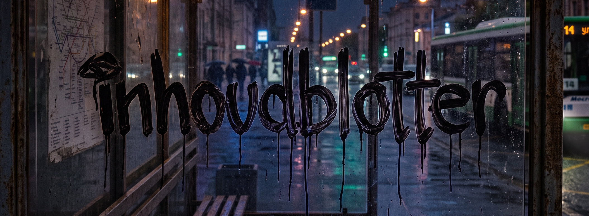

# MVP Develop Pipeline

**Agent-Driven Development**: пайплайн из ИИ-агентов, которые проводят продукт от сырой идеи до готового к разработке плана — рыночный ресерч, юнит-экономика, архитектура, UX-флоу — и дальше, через отделы разработки и девопс, до работающего MVP.

Сейчас в тестировании — отдел **Discovery** ([departments/discovery](departments/discovery)). На выходе вы получаете готовый пакет для принятия решения об инвестировании (инвестмемо с вердиктом Go/No-Go, питч-дек, roadmap запуска) и техническую документацию для старта разработки (Job Stories, флоу, оценка сложности). Дальше подключатся отделы архитектуры, разработки, девопс и тестирования.

## Дашборд проекта

Граф взаимодействия агентов и вся аналитика по проекту (статусы, покрытие контрактов, критический путь, распределение LLM-моделей, плейбуки, артефакты) — на живой странице дашборда: **[inhoudblotter.github.io/sketches](https://inhoudblotter.github.io/sketches/)**.

## Быстрый старт

Инструкции по установке, запуску пайплайна и сбору аналитики — в [HUMANS.md](HUMANS.md).

Проект ориентирован на пользователей Claude Code, но вы можете его адаптировать для запуска на любом LLM-раннере.

## 🧪 Публичное тестирование (Фаза 1)

Сейчас проходит публичное тестирование первой фазы проекта (отдел Discovery). Я буду очень рад вашему фидбеку, сообщениям о найденных багах и любым предложениям по улучшению! Вы можете открывать Issues или писать мне напрямую (контакты внизу страницы).

## Поддержать проект или обсудить сотрудничество

- [inhoudblotter@gmail.com](mailto:inhoudblotter@gmail.com)
- [Telegram](https://t.me/inhoudblotter)
- [DonationAlerts](https://dalink.to/inhoudblotter)

Можете разместить рекламу вашего продукта на этой стене, принимаются только граффити-изображения логотипов спонсоров.
